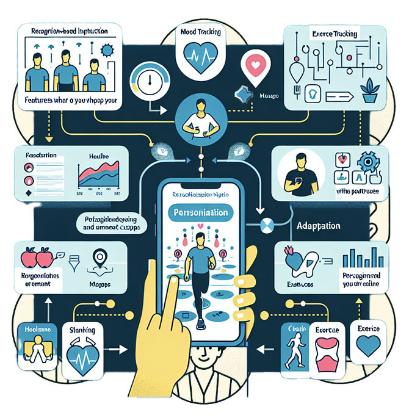
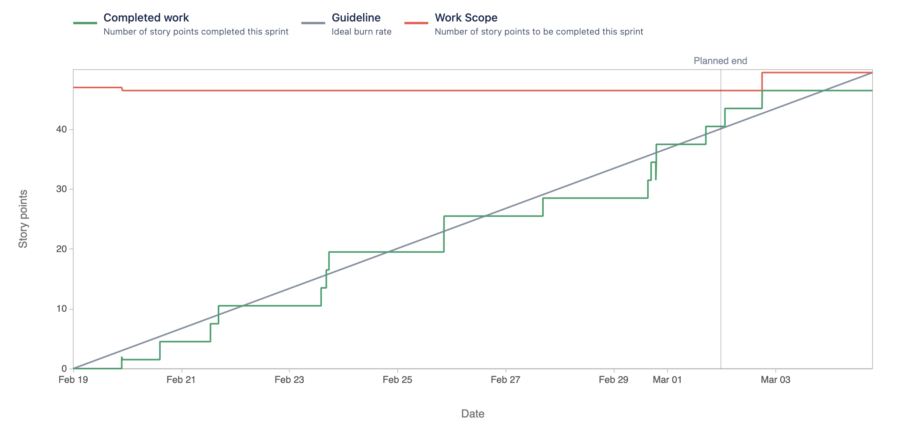

# HealthVista

## General Information

**Team Members:**
Visahl Manral, Balmiki R. Padhyaya, Keshav Adhikari, and Muhammad Qasim

**Problem Statement:**
HealthVista aims to address the current challenges in health management by providing a comprehensive and user-centric platform. The project intends to simplify health monitoring, encourage proactive well-being, and deliver personalized health insights.

## Project Overview

**HealthVista** is a health management system designed to cater to individuals who seek a holistic approach to monitor and improve their health. The platform integrates various features to offer a seamless user experience.

## Audience

The primary audience for HealthVista includes individuals who are conscious about their health and well-being. Whether managing chronic conditions, maintaining a fitness routine, or simply seeking a personalized health dashboard, HealthVista caters to a diverse user base.

## Purpose

We are developing HealthVista to make a positive impact on individuals' lives by providing them with a user-friendly tool to monitor and manage their health proactively. Our goal is to empower users with meaningful insights and encourage healthier lifestyle choices.

## Image

## Technologies

- Python
- React
- Flask
- MongoDB (MERN Stack)
- CSS
- HTML

## Features (Sprint 1)

## Contributions

**Balmiki**: "Set up the Health Vista login page and improved user experience by getting necessary info from MongoDB. "

- `Jira Task: Design and planning of Login page`
- [Scrum-11] (https://cs3398s24europa.atlassian.net/jira/software/projects/SCRUM/boards/1?selectedIssue=SCRUM-11),
- [Bitbucket] (https://bitbucket.org/cs3398s24europa/health-vista/branch/Balmiki_bfv12)
- `Jira Task: Backend Implementation for text fields in Login Page`
- [Scrum-14] (https://cs3398s24europa.atlassian.net/jira/software/projects/SCRUM/boards/1?selectedIssue=SCRUM-14),
- [Bitbucket] (https://bitbucket.org/cs3398s24europa/health-vista/branch/SCRUM-14-backend-implementation-of-login-page)
- `Jira Task: Frontend Implementation of Login Page`
- [Scrum-13] (https://cs3398s24europa.atlassian.net/jira/software/projects/SCRUM/boards/1?selectedIssue=SCRUM-13),
- [Bitbucket] (https://bitbucket.org/cs3398s24europa/health-vista/branch/feature/SCRUM-13-frontend-implementation-of-login-page)
- `Jira Task: Design backend and frontend for "forgot password" and "remember me"  feature in login page `
- [Scrum-41] (https://cs3398s24europa.atlassian.net/jira/software/projects/SCRUM/boards/1?selectedIssue=SCRUM-41),
- [Bitbucket] (https://bitbucket.org/cs3398s24europa/health-vista/branch/SCRUM-14-backend-implementation-of-login-page)
   

## Reports

## Future Features

In future sprints, we plan to implement the following features:

- Wellness/fitness
- Medication Management
- Chatbot
- Content library
- Hospital/doctor finder
- Insurance recommender
