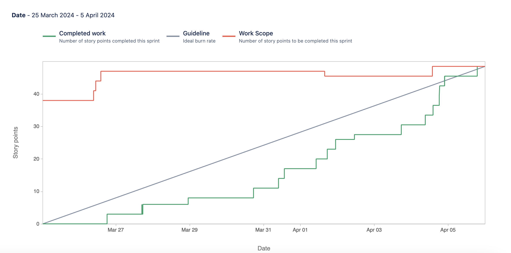

# HealthVista

## General Information

**Team Members:**
Visahl Manral, Balmiki R. Padhyaya, Keshav Adhikari, and Muhammad Qasim

**Problem Statement:**
HealthVista aims to address the current challenges in health management by providing a comprehensive and user-centric platform. The project intends to simplify health monitoring, encourage proactive well-being, and deliver personalized health insights.

## Project Overview

**HealthVista** is a health management system designed to cater to individuals who seek a holistic approach to monitor and improve their health. The platform integrates various features to offer a seamless user experience.

## Audience

The primary audience for HealthVista includes individuals who are conscious about their health and well-being. Whether managing chronic conditions, maintaining a fitness routine, or simply seeking a personalized health dashboard, HealthVista caters to a diverse user base.

## Purpose

We are developing HealthVista to make a positive impact on individuals' lives by providing them with a user-friendly tool to monitor and manage their health proactively. Our goal is to empower users with meaningful insights and encourage healthier lifestyle choices.

## Image

## Technologies

- Python
- React
- Flask
- MongoDB
- REST API
- CSS
- HTML

## Features (Sprint 1)

## Contributions

**Balmiki**: "Set up the Health Vista login page and improved user experience by getting necessary info from MongoDB. "

- `Jira Task: Design and planning of Login page`
    - [Scrum-11](https://cs3398s24europa.atlassian.net/jira/software/projects/SCRUM/boards/1?selectedIssue=SCRUM-11),
      [Bitbucket](https://bitbucket.org/cs3398s24europa/health-vista/branch/Balmiki_bfv12)
- `Jira Task: Backend Implementation for text fields in Login Page`
    - [Scrum-14](https://cs3398s24europa.atlassian.net/jira/software/projects/SCRUM/boards/1?selectedIssue=SCRUM-14),
      [Bitbucket](https://bitbucket.org/cs3398s24europa/health-vista/branch/SCRUM-14-backend-implementation-of-login-page)
- `Jira Task: Frontend Implementation of Login Page`
    - [Scrum-13](https://cs3398s24europa.atlassian.net/jira/software/projects/SCRUM/boards/1?selectedIssue=SCRUM-13),
      [Bitbucket](https://bitbucket.org/cs3398s24europa/health-vista/branch/feature/SCRUM-13-frontend-implementation-of-login-page)
- `Jira Task: Design backend and frontend for "forgot password" and "remember me" feature in login page`
    - [Scrum-41](https://cs3398s24europa.atlassian.net/jira/software/projects/SCRUM/boards/1?selectedIssue=SCRUM-41),
      [Bitbucket](https://bitbucket.org/cs3398s24europa/health-vista/branch/SCRUM-14-backend-implementation-of-login-page)
      
     

**Vishal**: "Set up a fully functioning Sign Up page of our web application and also created a create profile page "

- `Jira Task: Task 1: Design Sign-Up Page UI Component`
    - [Scrum-59](https://cs3398s24europa.atlassian.net/jira/software/projects/SCRUM/boards/1?selectedIssue=SCRUM-59),
      [Bitbucket](https://bitbucket.org/cs3398s24europa/health-vista/branch/Vishal_trq7)
- `Jira Task: Task 2: Create Sign-Up Page Frontend Logic`
    - [Scrum-61](https://cs3398s24europa.atlassian.net/jira/software/projects/SCRUM/boards/1?selectedIssue=SCRUM-61),
      [Bitbucket](https://bitbucket.org/cs3398s24europa/health-vista/branch/feature/SCRUM-61-create-sign-up-page-frontend-logic)
- `Jira Task: Task 3: Implement Sign-Up Page Backend Functionality`
    - [Scrum-60](https://cs3398s24europa.atlassian.net/jira/software/projects/SCRUM/boards/1?selectedIssue=SCRUM-60),
      [Bitbucket](https://bitbucket.org/cs3398s24europa/health-vista/branch/feature/SCRUM-60-task-3-implement-sign-up-page-backend-functionality)
- `Jira Task: Task 4:  Create Register Profile Page`
    - [Scrum-62](https://cs3398s24europa.atlassian.net/jira/software/projects/SCRUM/boards/1?selectedIssue=SCRUM-62),
      [Bitbucket](https://bitbucket.org/cs3398s24europa/health-vista/branch/feature/SCRUM-62-task-4-create-register-profile-page)

     

**Keshav**: "Created a wellness page and also used youtube API to integrate the wellness videos from youtube based on users' needs. Also Implemented the UI color scheme for better experience for the users. "

- `Jira Task: Design Frontend for implementation of Wellness Page`
    - [Scrum-16](https://cs3398s24europa.atlassian.net/browse/SCRUM-16),
      [Bitbucket](https://bitbucket.org/cs3398s24europa/health-vista/branch/SCRUM-16-design-frontend-for-wellnesspage)
- `Jira Task: Integrate YouTube API for Wellness Video Display`
    - [Scrum-52](https://cs3398s24europa.atlassian.net/browse/SCRUM-52),
      [Bitbucket](https://bitbucket.org/cs3398s24europa/%7B9c8918aa-41ac-400d-827f-ee8d29096d85%7D/branch/SCRUM-52-integrate-youtube-api-for-wellnesspage)
- `Jira Task: Improve UI Color Scheme for UX`
    - [Scrum-15](https://cs3398s24europa.atlassian.net/browse/SCRUM-15),
      [Bitbucket](https://bitbucket.org/cs3398s24europa/%7B9c8918aa-41ac-400d-827f-ee8d29096d85%7D/branch/SCRUM-15-improve-ui-color-scheme-for-ux)
      
     
    
**Muhammad**: "Made the navbar and connected all the pages, designed the homepage,set up the popup contact form, and payment page UI. I also integrated the Stripe API to implement the payment backend and stored the selected plan in the database."

- `Jira Task: Design Component and link the homepage to other pages for Landing Page`
    - [Scrum-29](https://cs3398s24europa.atlassian.net/browse/SCRUM-29),
      [Bitbucket](https://bitbucket.org/cs3398s24europa/health-vista/branch/Muhammad-Ned44)
- `Jira Task: Add FAQ Section, Implement Footer, and Update Color Scheme in Landing page`
    - [Scrum-38](https://cs3398s24europa.atlassian.net/browse/SCRUM-38),
      [Bitbucket](https://bitbucket.org/cs3398s24europa/health-vista/branch/feature/SCRUM-38-add-faq-section-implement-foote)
- `Jira Task: Popup Contact form on the Landing page`
    - [Scrum-35](https://cs3398s24europa.atlassian.net/browse/SCRUM-35),
      [Bitbucket](https://bitbucket.org/cs3398s24europa/health-vista/branch/feature/SCRUM-35-popup-contact-form-on-the-landi)
- `Jira Task:  Implement Payment Plan Feature on sign up `
    - [Scrum-33](https://cs3398s24europa.atlassian.net/browse/SCRUM-33),
      [Bitbucket](https://bitbucket.org/cs3398s24europa/%7B9c8918aa-41ac-400d-827f-ee8d29096d85%7D/branch/feature/SCRUM-33-implement-payment-plan-feature-)
- `Jira Task:  Update Database for Upgrade Payment Plan Post-Signup `
    - [Scrum-76](https://cs3398s24europa.atlassian.net/browse/SCRUM-76),
      [Bitbucket](https://bitbucket.org/cs3398s24europa/%7B9c8918aa-41ac-400d-827f-ee8d29096d85%7D/branch/SCRUM-76-update-database-for-upgrade-pay)
     

## Burnup Report of Sprint 1

## Next Steps for Sprint 1

**Balmiki**:

- Integrate personal dashboard of registered user
- Implement map feature for finding nearby hospitals and health professionals
- Develop consistent layout for application

**Vishal**:

- Implement backend of Create Profile page and connect Create Profile page to database
- Implement medicine tracker 
- Implement blog tab UI

**Keshav**:

- Implement a insurance recommender feature for the users 
- Test the insurance recommender feature thoroughly to ensure accuracy, relevance, and usability.

**Muhammad**:

- Design chatbot UI
- Implement chatbot functionality 
- Implement nutrition tracker

## Features (Sprint 2)

## Contributions

**Keshav**: "Completed a research on which Health Insurance API would be best to integrate and returns health insurance information and pricing 
estimates for the plans for which users can sign up. Implemented the UI for Insurance Recommender and used Marketplace Health Insurance API to integreate the plans.
Also created a terms and condition for health-vista users."

- `Jira Task:Research and Select Insurance API for Backend Integration`
    - [Scrum-72](https://cs3398s24europa.atlassian.net/browse/SCRUM-72),
      [Bitbucket](https://bitbucket.org/cs3398s24europa/%7B9c8918aa-41ac-400d-827f-ee8d29096d85%7D/branch/SCRUM-72-research-and-select-insurance-APIS)
- `Jira Task:Design and Implement Insurance Section UI Component`
    - [Scrum-63](https://cs3398s24europa.atlassian.net/browse/SCRUM-63),
      [Bitbucket](https://bitbucket.org/cs3398s24europa/%7B9c8918aa-41ac-400d-827f-ee8d29096d85%7D/branch/feature/SCRUM-63-design-and-implement-insurance-Section-UI-Component)
- `Jira Task:Backend Implementation for Insurance Provider Integration`
    - [Scrum-36](https://cs3398s24europa.atlassian.net/browse/SCRUM-36),
      [Bitbucket](https://bitbucket.org/cs3398s24europa/%7B9c8918aa-41ac-400d-827f-ee8d29096d85%7D/branch/feature/SCRUM-36-backend-implementation-for-insurance)

- `Jira Task:Implement Terms and Conditions Page`
    - [Scrum-39](https://cs3398s24europa.atlassian.net/browse/SCRUM-39),
      [Bitbucket](https://bitbucket.org/cs3398s24europa/%7B9c8918aa-41ac-400d-827f-ee8d29096d85%7D/branch/feature/SCRUM-39-implement-terms-and-conditions)
      
     
    
    
**Balmiki**: "Developed the map feature to locate nearby hospitals, integrating geolocation services for efficient navigation and access to emergency medical services."

- `Jira Task: Design basic layout and Integrate map for finding nearby hospital`
    - [Scrum-25](https://cs3398s24europa.atlassian.net/jira/software/projects/SCRUM/boards/1?selectedIssue=SCRUM-25),
      [Bitbucket](https://bitbucket.org/cs3398s24europa/health-vista/branch/feature/SCRUM-25-design-basic-layout-and-integrate-map-feature-for-locating-hospital)
- `Jira Task: Researching map APIs and required tools for map feature`
    - [Scrum-28](https://cs3398s24europa.atlassian.net/jira/software/projects/SCRUM/boards/1?selectedIssue=SCRUM-28),
      [Bitbucket](https://bitbucket.org/cs3398s24europa/health-vista/branch/SCRUM-28-researching-map-APIs-and-their-required-tools)
- `Jira Task: Backend Implementation of Map features (nearby hospital's details)`
    - [Scrum-27](https://cs3398s24europa.atlassian.net/jira/software/projects/SCRUM/boards/1?selectedIssue=SCRUM-27),
      [Bitbucket](https://bitbucket.org/cs3398s24europa/health-vista/branch/feature/SCRUM-27-backend-implementation-of-map-feature)
- `Jira Task: Frontend Implementation of Map(Hospital finder)`
    - [Scrum-26](https://cs3398s24europa.atlassian.net/jira/software/projects/SCRUM/boards/1?selectedIssue=SCRUM-26),
      [Bitbucket](https://bitbucket.org/cs3398s24europa/health-vista/branch/feature/SCRUM-26-frontend-implementation-of-mapnearby-hospital)
      
     

**Vishal**: "Implemented the backend of the profile page to connect it to the database to save the user's profile information. Designed the UI of the article/blog page and used API to fetch articles and links. Implemented the medicine tracker feature to take user's medicine information and save it to our database"

- `Jira Task: Implement Backend of Profile Page And Update Database`
    - [Scrum-21](https://cs3398s24europa.atlassian.net/jira/software/projects/SCRUM/boards/1?selectedIssue=SCRUM-21),
      [Bitbucket](https://bitbucket.org/cs3398s24europa/health-vista/branch/feature/SCRUM-21-implement-backend-of-profile-page)
- `Jira Task: Design Article/Blog Page UI Component And Use API To Fetch Articles`
    - [Scrum-71](https://cs3398s24europa.atlassian.net/jira/software/projects/SCRUM/boards/1?selectedIssue=SCRUM-71),
      [Bitbucket](https://bitbucket.org/cs3398s24europa/health-vista/branch/feature/SCRUM-71-task-1-design-article-blog-page)
- `Jira Task: Frontend Implementation for Medication Management`
    - [Scrum-22](https://cs3398s24europa.atlassian.net/jira/software/projects/SCRUM/boards/1?selectedIssue=SCRUM-22),
      [Bitbucket](https://bitbucket.org/cs3398s24europa/health-vista/branch/feature/SCRUM-22-frontend-implementation-for-medication-tracker)
- `Jira Task: Backend Implementation for Medication Management`
    - [Scrum-19](https://cs3398s24europa.atlassian.net/jira/software/projects/SCRUM/boards/1?selectedIssue=SCRUM-19),
      [Bitbucket](https://bitbucket.org/cs3398s24europa/health-vista/branch/feature/SCRUM-19-backend-implementation-for-medication)
      
     
    
**Muhammad**: "Implemented the backend of the nutrition tracker page. Designed the UI of the nutrition tracker component and integrated the API from API Ninjas to fetch nutritional data. Implemented the chatbot feature, designed the UI, and integrated the OpenAI API to provide conversational functionality. Updated the MongoDB database to store the chat history from the chatbot."

- `Jira Task: Design Nutrition Tracker UI Component`
    - [Scrum-73](https://cs3398s24europa.atlassian.net/browse/SCRUM-73),
      [Bitbucket](https://bitbucket.org/cs3398s24europa/%7B9c8918aa-41ac-400d-827f-ee8d29096d85%7D/branch/feature/SCRUM-73-design-nutrition-tracker-ui-com)
- `Jira Task: Nutrition Tracker with API Ninjas Integration`
    - [Scrum-79](https://cs3398s24europa.atlassian.net/browse/SCRUM-79),
      [Bitbucket](https://bitbucket.org/cs3398s24europa/health-vista/branch/feature/SCRUM-73-design-nutrition-tracker-ui-com)
- `Jira Task: Design Chatbot UI Component`
    - [Scrum-65](https://cs3398s24europa.atlassian.net/browse/SCRUM-65),
      [Bitbucket](https://bitbucket.org/cs3398s24europa/health-vista/branch/feature/SCRUM-65-task-1-design-chatbot-ui-compon)
- `Jira Task: Integrate OpenAI API for Chatbot Functionality`
    - [Scrum-66](https://cs3398s24europa.atlassian.net/browse/SCRUM-66),
      [Bitbucket](https://bitbucket.org/cs3398s24europa/health-vista/branch/SCRUM-66-integrate-openai-api-for-chatbo)
- `Jira Task: Update MongoDB with Chat History from chatbot`
    - [Scrum-77](https://cs3398s24europa.atlassian.net/browse/SCRUM-77),
      [Bitbucket](https://bitbucket.org/cs3398s24europa/health-vista/branch/feature/SCRUM-77-update-mongodb-with-chat-histor)

     
    
## Burnup Report of Sprint 2

## Next Steps for Sprint 2

**Keshav**:

- Plans Details Page for Insurance Recommendation
- Design the final UI of the website
- Test the overall functionality of the program 

**Balmiki**:

- Implement appointment scheduling feature
- Integrate calendar for managing appointments
- Implement reminders for upcoming appointments

**Vishal**:

- Implement google calendar API to set reminders
- Create session id for login
- Manage features according to user's subscription

**Muhammad**:

- Implement front-end logic for insurance plan
- Create logout feature
- Implement database for nutrition tracker and change API to USDA foodData central

## Future Features

In future sprints, we plan to implement the following features:

- logout
- google calander api 
- insurance plan details page
- remainder for upcoming appointments

